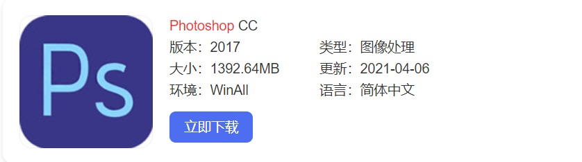

<html>
<body>
<body bgcolor="#FAEBD7"></body>

<link rel="stylesheet" href="字体大小.css">
PS基本介绍
<h1>
    PS，是美国Adobe公司旗下图像处理软件Photoshop的简称，引申为使用Photoshop软件处理图片，使其变得和原图不一样。PS还有附言、附录等其他意思。
</h1>
<ul>
    <li><a href="PS的发展历史和产品功能.html"target="_blank">PS的发展历史和产品功能</a></li>
    <li><a href="组成.html"target="_blank">组成</a></li>
    <li><a href="PS安装与快捷键.html"target="_blank">PS安装与快捷键</a></li>
</ul>

</body>
</html>  
